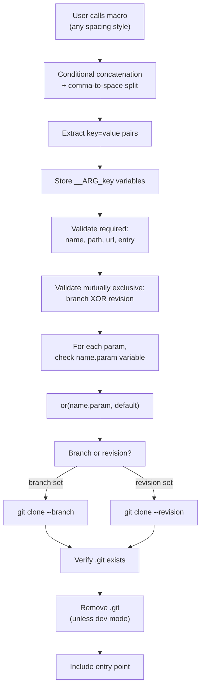

# Complete Dependency Override System

> **Status**: Accepted
> **Project**: make-bowerbird-deps
> **Created**: 2025-12-20
> **Author**: Bowerbird Team

## Overview

Comprehensive redesign implementing:

1. **Command-Line Overrides** - Simple dot notation using Make's built-in variable system
2. **Keyword Arguments** - Clear, self-documenting API
3. **Branch/Revision Distinction** - `branch=` for branches/tags, `revision=` for SHAs
4. **Robust Parser** - Concat-split handles flexible spacing, no undefined-var warnings

## User-Facing API

### Command-Line Override Syntax

```bash
# Override branch
make check bowerbird-help.branch=feature-xyz

# Override to specific SHA
make test bowerbird-test.revision=abc123def

# Override URL (test a fork)
make check bowerbird-help.url=https://github.com/myuser/fork.git

# Override path
make check bowerbird-help.path=/tmp/custom-location

# Override entry point
make check bowerbird-help.entry=alternative.mk

# Multiple overrides
make check bowerbird-help.branch=v2.0 bowerbird-test.revision=specific-commit

# Combine with dev mode
make check -- --bowerbird-dev-mode bowerbird-help.branch=experimental
```

### Macro Syntax

```makefile
# Using branch (for branches and tags)
$(call bowerbird::git-dependency, \
    name=bowerbird-help, \
    path=$(WORKDIR_DEPS)/bowerbird-help, \
    url=https://github.com/ic-designer/make-bowerbird-help.git, \
    branch=main, \
    entry=bowerbird.mk)

# Using revision (for specific commit SHAs)
$(call bowerbird::git-dependency, \
    name=bowerbird-test, \
    path=$(WORKDIR_DEPS)/bowerbird-test, \
    url=https://github.com/ic-designer/make-bowerbird-test.git, \
    revision=abc123def456789, \
    entry=bowerbird.mk)

# Compact style (no spaces)
$(call bowerbird::git-dependency,name=foo,path=bar,url=baz,branch=main,entry=qux)
```

## Implementation

### Step 1: Parser Helper

**File:** [`src/bowerbird-deps/bowerbird-deps.mk`](src/bowerbird-deps/bowerbird-deps.mk) after line 22

```makefile
# Define comma variable (needed for substitution)
, := ,

# Keyword arguments limit (we support one less than this value)
KEYWORD_ARGS_LIMIT := 11

# bowerbird::deps::parse-keyword-args,<args...>
#
#   Parses keyword arguments with flexible spacing.
#   Supports up to 10 arguments (KEYWORD_ARGS_LIMIT - 1).
#   Errors if KEYWORD_ARGS_LIMIT or more arguments are provided.
#
__ARG_NUMS := $(filter-out $(KEYWORD_ARGS_LIMIT),$(shell seq 1 $(KEYWORD_ARGS_LIMIT)))
define bowerbird::deps::parse-keyword-args
# Dynamically build the argument list
$(eval __ALL_ARGS := $(foreach n,$(__ARG_NUMS),$(if $($n),$(if $(filter 1,$n),$($n),$(,)$($n)))))
# Replace commas with spaces
$(eval __SPLIT_ARGS := $(subst $(,),$(space),$(__ALL_ARGS)))
# Error if word at KEYWORD_ARGS_LIMIT position exists (too many args)
$(if $(word $(KEYWORD_ARGS_LIMIT),$(__SPLIT_ARGS)),\
    $(error ERROR: Keyword argument limit reached (KEYWORD_ARGS_LIMIT=$(KEYWORD_ARGS_LIMIT))))
# Parse each key=value pair
$(foreach arg,$(__SPLIT_ARGS),\
    $(if $(findstring =,$(arg)),\
        $(eval __CLEAN := $(strip $(arg)))\
        $(eval __KV := $(subst =, ,$(__CLEAN)))\
        $(eval __ARG_$(word 1,$(__KV)) := $(word 2,$(__KV)))\
    )\
)
endef
```

### Step 2: Main Macro

**File:** [`src/bowerbird-deps/bowerbird-deps.mk`](src/bowerbird-deps/bowerbird-deps.mk) lines 33-67

```makefile
# bowerbird::git-dependency,<keyword-args>
#
#   Installs a git dependency using keyword arguments.
#   Requires exactly one of 'branch' or 'revision' (mutually exclusive).
#   Flexible spacing: works with or without spaces after commas.
#
#   Note: Uses eval define to substitute __MAKE_ARG_LIST (dynamically generated $(1),$(2),...,$(10))
#         at parse time, avoiding hardcoded argument lists.
#
#   Args (keyword arguments, any order):
#       name=<name>: Dependency name (for override variables)
#       path=<path>: Installation path
#       url=<url>: Git repository URL
#       branch=<branch>: Branch or tag name (uses git clone --branch)
#       revision=<sha>: Specific commit SHA (uses git clone --revision)
#       entry=<entry>: Entry point file (relative path)
#
#   Note: Specify either 'branch' OR 'revision', not both.
#
#   Command-Line Overrides:
#       <name>.branch=<value> - Override branch/tag
#       <name>.revision=<value> - Override to specific SHA
#       <name>.url=<value> - Override repository URL
#       <name>.path=<value> - Override installation path
#       <name>.entry=<value> - Override entry point
#
#   Examples:
#       # Using branch (readable with spaces)
#       $(call bowerbird::git-dependency, \
#           name=bowerbird-help, \
#           path=$(WORKDIR_DEPS)/bowerbird-help, \
#           url=https://github.com/ic-designer/make-bowerbird-help.git, \
#           branch=main, \
#           entry=bowerbird.mk)
#
#       # Using revision (compact without spaces)
#       $(call bowerbird::git-dependency,\
#           name=bowerbird-test,\
#           path=$(WORKDIR_DEPS)/bowerbird-test,\
#           url=https://github.com/ic-designer/make-bowerbird-test.git,\
#           revision=abc123def456,\
#           entry=bowerbird.mk)
#
#   Override examples:
#       make check bowerbird-help.branch=feature-xyz
#       make test bowerbird-test.revision=abc123
#       make check bowerbird-help.url=https://github.com/user/fork.git
#
__MAKE_ARG_LIST := $(subst $(space),$(,),$(foreach n,$(__ARG_NUMS),$$($$($n))))
$(eval define bowerbird::git-dependency
$$(eval $$(call bowerbird::deps::parse-keyword-args,$(__MAKE_ARG_LIST)))
$$(eval \
    $$(if $$(__ARG_name),,$$(error ERROR: 'name' parameter is required)) \
    $$(if $$(__ARG_path),,$$(error ERROR: 'path' parameter is required)) \
    $$(if $$(__ARG_url),,$$(error ERROR: 'url' parameter is required)) \
    $$(if $$(__ARG_entry),,$$(error ERROR: 'entry' parameter is required)) \
    $$(if $$(and $$(__ARG_branch),$$(__ARG_revision)),\
        $$(error ERROR: Cannot specify both 'branch' and 'revision')) \
    $$(if $$(or $$(__ARG_branch),$$(__ARG_revision)),,\
        $$(error ERROR: Must specify either 'branch' or 'revision')) \
    $$(call bowerbird::deps::git-dependency-implementation,\
        $$(or $$($$(__ARG_name).path),$$(__ARG_path)),\
        $$(or $$($$(__ARG_name).url),$$(__ARG_url)),\
        $$(or $$($$(__ARG_name).branch),$$(__ARG_branch)),\
        $$(or $$($$(__ARG_name).revision),$$(__ARG_revision)),\
        $$(or $$($$(__ARG_name).entry),$$(__ARG_entry))) \
)
endef)
```

### Step 3: Implementation Macro

**File:** [`src/bowerbird-deps/bowerbird-deps.mk`](src/bowerbird-deps/bowerbird-deps.mk) around line 93

```makefile
# bowerbird::deps::git-dependency-implementation,<path>,<url>,<branch>,<revision>,<entry>
#
#   Implementation that clones the dependency.
#   Uses --branch if branch is specified, --revision if revision is specified.
#   Parameters are already resolved with overrides applied.
#
define bowerbird::deps::git-dependency-implementation
    $$(eval __BOWERBIRD_DEP_PATH := $1)
    $$(eval __BOWERBIRD_DEP_URL := $2)
    $$(eval __BOWERBIRD_DEP_BRANCH := $3)
    $$(eval __BOWERBIRD_DEP_REVISION := $4)
    $$(eval __BOWERBIRD_DEP_ENTRY := $5)

    $$(__BOWERBIRD_DEP_PATH)/.:
		$$(if $(__BOWERBIRD_KEEP_GIT),@echo "INFO: Cloning dependency in DEV mode: $$(__BOWERBIRD_DEP_URL)")
		@git clone --config advice.detachedHead=false \
				--config http.lowSpeedLimit=1000 \
				--config http.lowSpeedTime=60 \
				$$(__BOWERBIRD_CLONE_DEPTH) \
				$$(if $$(__BOWERBIRD_DEP_BRANCH),--branch $$(__BOWERBIRD_DEP_BRANCH),--revision $$(__BOWERBIRD_DEP_REVISION)) \
				$$(__BOWERBIRD_DEP_URL) \
				$$(__BOWERBIRD_DEP_PATH) || \
				(>&2 echo "ERROR: Failed to clone dependency '$$(__BOWERBIRD_DEP_URL)'" && exit 1)
		@test -n "$$(__BOWERBIRD_DEP_PATH)"
		@test -d "$$(__BOWERBIRD_DEP_PATH)/.git"
		$$(if $(__BOWERBIRD_KEEP_GIT),,@\rm -rfv -- "$$(__BOWERBIRD_DEP_PATH)/.git")

    $$(__BOWERBIRD_DEP_PATH)/$$(__BOWERBIRD_DEP_ENTRY): | $$(__BOWERBIRD_DEP_PATH)/.
		@test -d $$|
		@test -f $$@ || (\
			\rm -rf $$(__BOWERBIRD_DEP_PATH) && \
			>&2 echo "ERROR: Expected entry point not found: $$@" && \
			exit 1\
		)

    include $$(__BOWERBIRD_DEP_PATH)/$$(__BOWERBIRD_DEP_ENTRY)
endef
```

### Step 4: Update Dependencies

**File:** [`make/deps.mk`](make/deps.mk)

```makefile
# Error Checking
WORKDIR_DEPS ?= $(error ERROR: Undefined variable WORKDIR_DEPS)

# Load Dependencies
include src/bowerbird-deps/bowerbird-deps.mk

$(call bowerbird::git-dependency, \
    name=bowerbird-help, \
    path=$(WORKDIR_DEPS)/bowerbird-help, \
    url=https://github.com/ic-designer/make-bowerbird-help.git, \
    branch=main, \
    entry=bowerbird.mk)

$(call bowerbird::git-dependency, \
    name=bowerbird-githooks, \
    path=$(WORKDIR_DEPS)/bowerbird-githooks, \
    url=https://github.com/ic-designer/make-bowerbird-githooks.git, \
    branch=main, \
    entry=bowerbird.mk)

$(call bowerbird::git-dependency, \
    name=bowerbird-test, \
    path=$(WORKDIR_DEPS)/bowerbird-test, \
    url=https://github.com/ic-designer/make-bowerbird-test.git, \
    branch=main, \
    entry=bowerbird.mk)
```

### Step 5: Update Test Files

Convert all test files to use new syntax:

- [`test/bowerbird-deps/test-git-dependency.mk`](test/bowerbird-deps/test-git-dependency.mk) - 5 calls
- [`test/bowerbird-deps/test-dev-mode.mk`](test/bowerbird-deps/test-dev-mode.mk) - 2 calls

### Step 6: Add Comprehensive Tests

**File:** Create [`test/bowerbird-deps/test-override.mk`](test/bowerbird-deps/test-override.mk)

Test cases:

1. Override branch with dot notation
2. Override revision with dot notation
3. Override URL with dot notation
4. Override path with dot notation
5. Override entry with dot notation
6. Spacing: with spaces after commas
7. Spacing: without spaces
8. Spacing: mixed
9. Validation: both branch and revision (should error)
10. Validation: neither branch nor revision (should error)
11. Switch from branch to revision via override
12. Multiple overrides in one command

### Step 7: Update Documentation

**File:** [`README.md`](README.md)

Add comprehensive sections:

- New keyword syntax with examples
- Branch vs revision explanation
- Command-line override system
- Flexible spacing examples
- Migration guide

**File:** [`CHANGELOG.md`](CHANGELOG.md)

Document breaking changes and new features.

## Architecture



## Benefits

1. **Clear Intent** - branch vs revision makes purpose explicit
2. **Flexible** - Works with any spacing style
3. **Simple Overrides** - Uses Make's built-in variable system, no extra machinery
4. **Robust** - Concat-split handles all edge cases
5. **No Warnings** - Dynamic argument list generation avoids undefined variable references
6. **Safe** - Mutual exclusion prevents confusion
7. **Discoverable** - Keyword args are self-documenting
8. **Minimal** - No unnecessary helper macros (eliminated define-dependency-constants)
9. **Maintainable** - Argument limit configurable via single constant (KEYWORD_ARGS_LIMIT)
10. **Readable** - Implementation names parameters at start (__BOWERBIRD_DEP_PATH, __BOWERBIRD_DEP_URL, etc.) for clarity

## Migration Guide

```makefile
# Old (positional args)
$(call bowerbird::git-dependency, \
    $(WORKDIR_DEPS)/bowerbird-help, \
    https://github.com/ic-designer/make-bowerbird-help.git, \
    main, \
    bowerbird.mk)

# New (keyword args with branch)
$(call bowerbird::git-dependency, \
    name=bowerbird-help, \
    path=$(WORKDIR_DEPS)/bowerbird-help, \
    url=https://github.com/ic-designer/make-bowerbird-help.git, \
    branch=main, \
    entry=bowerbird.mk)
```

## Testing Checklist

- Keyword argument parsing with conditional concat
- Spacing variations (none, all, mixed)
- Branch parameter with --branch flag
- Revision parameter with --revision flag
- Mutual exclusion validation
- Required parameter validation
- Dot notation overrides (all params: path, url, branch, revision, entry)
- Switch branch to revision via override
- All 22+ existing tests pass
- Dev mode compatibility
- Override + dev mode combination

## Implementation Todos

1. **add-parser** - Add parse-keyword-args helper with dynamic arg generation from __MAKE_ARG_LIST
2. **rewrite-main-macro** - Rewrite bowerbird::git-dependency using eval define with branch/revision validation and direct $(or) overrides
3. **simplify-impl-macro** - Simplify implementation to use parameters directly (no constants macro needed)
4. **convert-deps-mk** - Convert make/deps.mk to keyword syntax with branch= (3 deps)
5. **convert-test-git** - Convert test-git-dependency.mk to keyword syntax (5 calls)
6. **convert-test-dev** - Convert test-dev-mode.mk to keyword syntax (2 calls)
7. **create-test-override** - Create test-override.mk with 10+ comprehensive test cases
8. **update-readme** - Update README with complete documentation
9. **update-changelog** - Update CHANGELOG with breaking changes and features
10. **run-tests** - Run full test suite - expect 32+ tests passing
