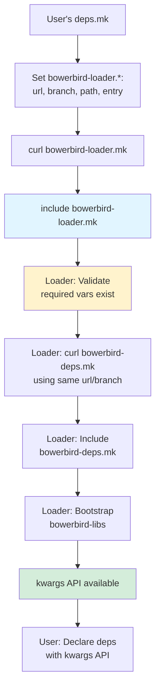

# Bowerbird Loader for Simplified Bootstrapping

```
Status:   Draft
Project:  make-bowerbird-deps
Created:  2026-01-15
Author:   Bowerbird Team
```

---

## Summary

Create `bowerbird-loader.mk` that automatically bootstraps both `bowerbird-deps` and `bowerbird-libs`, enabling users to immediately use the high-level kwargs API (`bowerbird::deps::git-dependency`) without manually managing the chicken-and-egg problem.

## Problem

Currently, users face a chicken-and-egg problem when bootstrapping dependencies:

1. **Manual bootstrapping required**: Users must manually curl `bowerbird-deps.mk` and set up override variables
2. **Forced low-level API usage**: The high-level kwargs API (`bowerbird::deps::git-dependency`) requires `bowerbird-libs` to be loaded first, forcing users to use the verbose, positional low-level API (`bowerbird::deps::git-dependency-low-level`) for all dependencies
3. **Repetitive boilerplate**: Every project needs ~17 lines of nearly identical bootstrap code
4. **Poor DX**: The intended user-friendly kwargs API is unavailable exactly when users need it most (dependency declaration)

Example of current required boilerplate:

```makefile
WORKDIR_DEPS ?= $(error ERROR: Undefined variable WORKDIR_DEPS)

# Bootstrap bowerbird-deps
BOWERBIRD_DEPS.MK := $(WORKDIR_DEPS)/bowerbird-deps/bowerbird_deps.mk
$(BOWERBIRD_DEPS.MK):
	@curl ... bowerbird-deps.mk
include $(BOWERBIRD_DEPS.MK)

# Must use low-level API because kwargs not available yet
$(call bowerbird::deps::git-dependency-low-level,bowerbird-libs,$(WORKDIR_DEPS)/bowerbird-libs,https://github.com/asikros/make-bowerbird-libs.git,main,,bowerbird.mk)
$(call bowerbird::deps::git-dependency-low-level,bowerbird-help,$(WORKDIR_DEPS)/bowerbird-help,https://github.com/asikros/make-bowerbird-help.git,main,,bowerbird.mk)
$(call bowerbird::deps::git-dependency-low-level,bowerbird-test,$(WORKDIR_DEPS)/bowerbird-test,https://github.com/asikros/make-bowerbird-test.git,main,,bowerbird.mk)
```

## Proposed Solution

Create `bowerbird-loader.mk` that:

1. **Validates required variables** set by caller (`bowerbird-loader.url`, `bowerbird-loader.branch`, `bowerbird-loader.path`)
2. **Reuses those variables** to download `bowerbird-deps.mk` from the same source/branch (ensures consistency)
3. **Automatically bootstraps** `bowerbird-libs` using the low-level API
4. **Exposes kwargs API** immediately for user dependency declarations

### Loader Implementation

**File:** `src/bowerbird-loader/bowerbird-loader.mk`

```makefile
# Error checking - require caller to set these variables
# This ensures the loader and deps come from the same source/branch
bowerbird-loader.url ?= $(error ERROR: bowerbird-loader.url must be set by caller)
bowerbird-loader.branch ?= $(error ERROR: bowerbird-loader.branch must be set by caller)
bowerbird-loader.path ?= $(error ERROR: bowerbird-loader.path must be set by caller)

WORKDIR_DEPS ?= $(error ERROR: Undefined variable WORKDIR_DEPS)

# Download bowerbird-deps.mk using the same URL/branch as the loader
$(bowerbird-loader.path)/bowerbird-deps.mk:
	@curl --silent --show-error --fail --create-dirs -o $@ -L \
	$(bowerbird-loader.url)/$(bowerbird-loader.branch)/src/bowerbird-deps/bowerbird-deps.mk

# Include bowerbird-deps.mk (co-located with loader)
-include $(bowerbird-loader.path)/bowerbird-deps.mk

# Bootstrap bowerbird-libs automatically using low-level API
$(call bowerbird::deps::git-dependency-low-level,bowerbird-libs,$(WORKDIR_DEPS)/bowerbird-libs,https://github.com/asikros/make-bowerbird-libs.git,main,,bowerbird.mk)

# Now bowerbird::deps::git-dependency is available!
```

### User's deps.mk

```makefile
WORKDIR_DEPS ?= $(error ERROR: Undefined variable WORKDIR_DEPS)

# Bootstrap the loader
bowerbird-loader.url ?= https://raw.githubusercontent.com/asikros/make-bowerbird-deps
bowerbird-loader.branch ?= main
bowerbird-loader.path ?= $(WORKDIR_DEPS)/bowerbird-loader
bowerbird-loader.entry ?= bowerbird-loader.mk

$(bowerbird-loader.path)/$(bowerbird-loader.entry):
	@curl --silent --show-error --fail --create-dirs -o $@ -L \
	$(bowerbird-loader.url)/$(bowerbird-loader.branch)/src/bowerbird-loader/bowerbird-loader.mk

include $(bowerbird-loader.path)/$(bowerbird-loader.entry)

# Use high-level kwargs API immediately!
$(eval $(call bowerbird::deps::git-dependency, \
	name=bowerbird-help, \
	url=https://github.com/asikros/make-bowerbird-help.git, \
	branch=main, \
	entry=bowerbird.mk))

$(eval $(call bowerbird::deps::git-dependency, \
	name=bowerbird-test, \
	url=https://github.com/asikros/make-bowerbird-test.git, \
	branch=main, \
	entry=bowerbird.mk))
```

## Alternatives Considered

### Alternative 1: Inline all dependencies in loader

**Approach:** Hardcode `bowerbird-libs` URL/branch in the loader, make it completely opaque.

**Rejected because:**
- Users lose ability to override `bowerbird-libs.branch` or `bowerbird-libs.url`
- Less flexible for development and testing
- Violates consistency with other dependencies

### Alternative 2: Separate loader repo

**Approach:** Create `make-bowerbird-loader` as a standalone repo.

**Rejected because:**
- Adds maintenance overhead (another repo to version/release)
- User still needs to know which version of loader works with which version of deps
- Loader is tightly coupled to deps implementation, separation creates artificial boundary
- Keeping them together ensures version compatibility

### Alternative 3: Shell script bootstrap

**Approach:** Provide a shell script that downloads and sets up everything.

**Rejected because:**
- Breaks Make-only design principle
- Platform compatibility issues (bash vs zsh vs sh)
- Harder to override with Make variables
- Can't reuse Make's variable system for overrides

### Alternative 4: Loader downloads deps via git clone

**Approach:** Use git clone instead of curl for bowerbird-deps.

**Rejected because:**
- Heavier weight (requires full git repo)
- Slower (network overhead for git metadata)
- Curl for single files is the established pattern
- Inconsistent with how deps itself is currently bootstrapped

## Trade-offs

### Benefits

1. **Consistency guaranteed**: Loader and deps always from same source/branch (reuses `bowerbird-loader.*` variables)
2. **Better DX**: Users can use clean kwargs API from the start
3. **Less boilerplate**: Reduced from ~17 lines to ~14 lines, with cleaner dependency declarations
4. **Backward compatible**: Existing projects using direct `bowerbird-deps.mk` inclusion continue to work
5. **Error validation**: Loader validates required variables are set by caller
6. **Override support**: All override variables still work (`bowerbird-loader.branch=dev`, `bowerbird-libs.branch=feature-x`)
7. **Discoverable**: Clear variable names make usage obvious

### Costs

1. **Additional file**: One more file (`bowerbird-loader.mk`) to maintain
2. **Double download**: Loader curls `bowerbird-deps.mk` (but minimal overhead, happens once)
3. **Learning curve**: Users need to understand loader vs direct deps usage (mitigated by clear docs)
4. **Implicit behavior**: `bowerbird-libs` bootstrap is now "magic" (but documented in loader source)

### Performance Implications

- Negligible: One additional small curl operation (bowerbird-deps.mk is ~200 lines)
- Downloads happen once and are cached in `$(WORKDIR_DEPS)`
- No impact on incremental builds

### Maintenance Implications

- Loader code is simple (~30 lines)
- Tightly coupled to deps implementation (not a separate versioning concern)
- Tests ensure loader stays in sync with deps API changes
- Clear error messages guide users if variables aren't set

## Examples

### Before and After Comparison

**Current approach (17 lines):**

```makefile
WORKDIR_DEPS ?= $(error ERROR: Undefined variable WORKDIR_DEPS)

# Load Bowerbird Dependency Tools
BOWERBIRD_DEPS.MK := $(WORKDIR_DEPS)/bowerbird-deps/bowerbird_deps.mk
$(BOWERBIRD_DEPS.MK):
	@curl --silent --show-error --fail --create-dirs -o $@ -L \
https://raw.githubusercontent.com/asikros/make-bowerbird-deps/\
main/src/bowerbird-deps/bowerbird-deps.mk
include $(BOWERBIRD_DEPS.MK)

# Bootstrap all dependencies using low-level positional API
$(call bowerbird::deps::git-dependency-low-level,bowerbird-libs,$(WORKDIR_DEPS)/bowerbird-libs,https://github.com/asikros/make-bowerbird-libs.git,main,,bowerbird.mk)
$(call bowerbird::deps::git-dependency-low-level,bowerbird-help,$(WORKDIR_DEPS)/bowerbird-help,https://github.com/asikros/make-bowerbird-help.git,main,,bowerbird.mk)
$(call bowerbird::deps::git-dependency-low-level,bowerbird-test,$(WORKDIR_DEPS)/bowerbird-test,https://github.com/asikros/make-bowerbird-test.git,main,,bowerbird.mk)
```

**New approach (14 lines, cleaner):**

```makefile
WORKDIR_DEPS ?= $(error ERROR: Undefined variable WORKDIR_DEPS)

# Bootstrap the Bowerbird loader
bowerbird-loader.url ?= https://raw.githubusercontent.com/asikros/make-bowerbird-deps
bowerbird-loader.branch ?= main
bowerbird-loader.path ?= $(WORKDIR_DEPS)/bowerbird-loader
bowerbird-loader.entry ?= bowerbird-loader.mk

$(bowerbird-loader.path)/$(bowerbird-loader.entry):
	@curl --silent --show-error --fail --create-dirs -o $@ -L \
	$(bowerbird-loader.url)/$(bowerbird-loader.branch)/src/bowerbird-loader/bowerbird-loader.mk
include $(bowerbird-loader.path)/$(bowerbird-loader.entry)

$(eval $(call bowerbird::deps::git-dependency, name=bowerbird-help, url=https://github.com/asikros/make-bowerbird-help.git, branch=main, entry=bowerbird.mk))
$(eval $(call bowerbird::deps::git-dependency, name=bowerbird-test, url=https://github.com/asikros/make-bowerbird-test.git, branch=main, entry=bowerbird.mk))
```

### Override Examples

```bash
# Override loader source (pulls deps from same branch)
make check bowerbird-loader.branch=dev-branch

# Override specific dependency versions
make check bowerbird-libs.branch=feature-x

# Override multiple dependencies
make check bowerbird-help.branch=v2.0 bowerbird-test.revision=abc123

# Combine with dev mode
make check -- --bowerbird-dev-mode bowerbird-help.branch=experimental
```

## Implementation Plan

### Phase 1: Create Loader

1. Create `src/bowerbird-loader/bowerbird-loader.mk`
2. Implement variable validation
3. Add `bowerbird-deps.mk` download logic
4. Add `bowerbird-libs` bootstrap call

### Phase 2: Testing

1. Create `test/bowerbird-loader/test-loader-basic.mk`
2. Test loader bootstraps successfully
3. Test `bowerbird-deps.mk` is downloaded correctly
4. Test `bowerbird-libs` is available
5. Test kwargs API works immediately
6. Test override variables propagate correctly

### Phase 3: Documentation

1. Update `README.md` with loader quick start
2. Add "Quick Start with Loader" section (recommended approach)
3. Move direct `bowerbird-deps.mk` usage to "Advanced Usage"
4. Document loader variables and overrides
5. Update `CHANGELOG.md`

### Phase 4: Migration Example

1. Migrate `make-bowerbird-githooks` as example
2. Update its `make/deps.mk` to use loader
3. Convert dependencies to kwargs API
4. Update its `CHANGELOG.md`

### Phase 5: Rollout

1. Announce in release notes
2. Update other bowerbird repos (optional, not required)
3. Future projects default to loader approach

## Testing Strategy

### Unit Tests

- Loader validates required variables are set
- Loader downloads `bowerbird-deps.mk` to correct location
- Loader includes `bowerbird-deps.mk` successfully
- Loader bootstraps `bowerbird-libs` automatically

### Integration Tests

- Full deps.mk using loader compiles without errors
- kwargs API (`bowerbird::deps::git-dependency`) works after loader inclusion
- Override variables work for loader itself (`bowerbird-loader.branch`)
- Override variables work for bootstrapped deps (`bowerbird-libs.branch`)
- Multiple dependencies can be declared with kwargs API

### Regression Tests

- Existing tests using direct `bowerbird-deps.mk` inclusion still pass
- Low-level API still works
- Dev mode still works
- Override system still works

## Migration Path

### For Existing Projects

**No migration required** - existing projects using direct `bowerbird-deps.mk` inclusion continue to work unchanged.

**Optional migration** - projects can opt-in to loader for better DX:

1. Replace `bowerbird-deps` bootstrap with `bowerbird-loader` bootstrap
2. Remove `bowerbird-libs` from dependency list (now automatic)
3. Convert remaining dependencies from low-level to kwargs API

### Breaking Changes

**None** - this is purely additive. The low-level API remains available and functional.

## Bootstrap Flow



## Files Changed

### New Files

- `src/bowerbird-loader/bowerbird-loader.mk`
- `test/bowerbird-loader/test-loader-basic.mk`

### Modified Files

- `README.md` - Add loader documentation
- `CHANGELOG.md` - Document new feature
- `development/proposals/INDEX.md` - Add this proposal

### Example Migration (Optional)

- `../make-bowerbird-githooks/make/deps.mk` - Migrate to loader
- `../make-bowerbird-githooks/CHANGELOG.md` - Document migration

## Open Questions

1. Should `bowerbird-libs` URL/branch be overridable in the loader, or always use defaults?
   - **Current approach:** Uses hardcoded defaults in loader, but overrides still work via `bowerbird-libs.*` variables

2. Should we provide a loader template in `make-bowerbird-docs`?
   - **Suggested:** Yes, add to examples or templates section

3. Should we migrate all bowerbird repos immediately or let them adopt gradually?
   - **Suggested:** Migrate one as example, let others adopt organically

## Success Criteria

- [ ] Loader successfully bootstraps both deps and libs
- [ ] kwargs API works immediately after loader inclusion
- [ ] All override variables work correctly
- [ ] Comprehensive tests pass
- [ ] Documentation is clear and complete
- [ ] At least one repo successfully migrated as example
- [ ] No regressions in existing functionality
